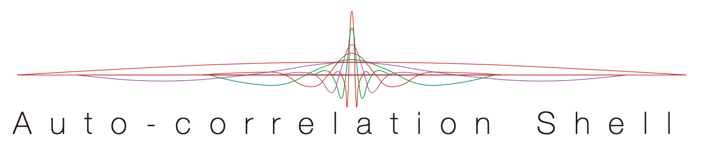
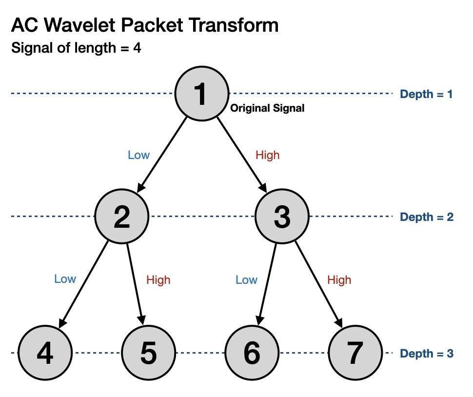

[](https://ShozenD.github.io/AutocorrelationShell.jl/stable)

[](https://ShozenD.github.io/AutocorrelationShell.jl/stable)
[](https://ShozenD.github.io/AutocorrelationShell.jl/dev)
[](https://github.com/ShozenD/AutocorrelationShell.jl/actions)
[](https://gitlab.com/BoundaryValueProblems/autocorrelation-shell/-/commits/master)
[](https://codecov.io/gh/ShozenD/AutocorrelationShell.jl)


This package is a [julia](https://github.com/JuliaLang/julia) implementation of autocorrelation wavelets. The package includes the 1D autocorrelation wavelet transform, 2D autocorrelation wavelet transform, and autocorrelation wavelet packet transform.

Signal representations using autocorrelation wavelets are redundant and non-orthogonal. Some desirable properties of autocorrelation wavelet transforms are symmetry without losing vanishing moments, edge detection and characterization capabilities, and shift invariance. Autocorrelation wavelets can be used as a tool for data analysis such as time series analysis and image analysis.

To see the examples of analysis done using AutocorrelationShell.jl and the presentations Statistics Research Training Program student conference at UC Davis visit the [analysis repository](https://github.com/ShozenD/RTG-Wavelet-Analysis-2020).

## Authors
This package was first translated from Matlab code by Rishi Subramanian, and was extended by Christina Chang, and Shozen Dan all under the supervision of Professor Naoki Saito at University of California, Davis.

## Usage
Load the autocorrelation module
```{julia}
using Wavelets, AutocorrelationShell
```

## 1D Autocorrelation Wavelet Transform
```{julia}
# Forward 1D Autocorrelation Wavelet Transform
y = acwt(x, wavelet(WT.db4))

# Inverse 1D Autocorrelation Wavelet Transform
iacwt(y)
```

### Example
Perform forward autocorrelation wavelet transform on the vector x
```{julia}
x = zeros(256); x[128] = 1;

# Decompose signal
y = acwt(x, wavelet(WT.db4))

# Display decomposition
wiggle(y)
```

Result:


## 2D Autocorrelation Wavelet Transform
```{julia}
# Forward 2D Autocorrelation Wavelet Transform
acwt(img, wavelet(WT.db4))
```
The `acwt` function performs a forward wavelet transformation on 2D signals such as images. It returns a 4 dimensional tensor(multidimensional array) with the dimensions (num_row, num_col, levels_of_decomp_row, levels_of_decomp_col).


```{julia}
# Inverse 2D Autocorrelation Wavelet Transform
iacwt2D(decomp)
```
The `iacwt` function is the inverse function of `acwt`. It takes an array of autocorrelation wavelet coefficients and reconstructs the original signal.

### Example
```{julia}
img = load(../test/pictures/boat.jpg)
img = Float64.(Gray.(img))

decomp = acwt2D(img, wavelet(WT.db4))

# Display the 6th row and column decomposition
acwt_heatmap(decomp[:,:,6,6])

# Revert to original signal
reconst = iacwt(decomp)
```

## Autocorrelation Wavelet Packet Transform
```{julia}
# Autocorrelation Wavelet Packet Transform
acwpt(x, P, Q)
```
The `acwpt` function computes the autocorrelation wavelet packet transform for 1 dimensional signal. It returns a binary tree where the root node contains the original signal, and each child node contains a vector of 1 dimensional autocorrelation wavelet transform coefficients.



### Example
```{julia}
using Random, Wavelets, AbstractTrees
rng = MersenneTwister(123);

X₁ = randn(rng, 4); # length 4 random signal

y = acwpt(X₁, wavelet(WT.db4))
```
