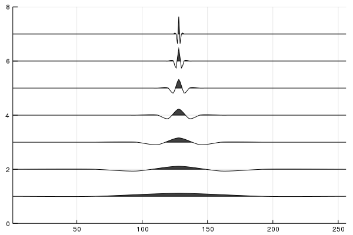

# AutocorrelationShell.jl

This package is a [julia](https://github.com/JuliaLang/julia) implementation of autocorrelation wavelets. The package includes the 1D autocorrelation wavelet transform, 2D autocorrelation wavelet transform, and autocorrelation wavelet packet transform.

Signal representations using autocorrelation wavelets are redundant and non-orthogonal. Some desirable properties of autocorrelation wavelet transforms are symmetry without losing vanishing moments, edge detection and characterization capabilities, and shift invariance. Autocorrelation wavelets can be used as a tool for data analysis such as time series analysis and image analysis.

For more details refer to the [documentation](https://boundaryvalueproblems.gitlab.io/autocorrelation-shell/)

## Dependencies
The required packages are
+ `AbstractTrees`
+ `DSP`
+ `LinearAlgebra`
+ `Plots`
+ `Statistics`
+ `StatsBase`
+ `Wavelets`

## Usage
Load the autocorrelation module
```{julia}
include("./src/AutocorrelationShell.jl")
using Main.AutocorrelationShell
```

## 1D Autocorrelation Wavelet Transform
```{julia}
# Forward 1D Autocorrelation Wavelet Transform
acwt(x; L, P, Q)

# Inverse 1D Autocorrelation Wavelet Transform
iacwt(decomp)
```

### Example
Perform forward autocorrelation wavelet transform on the vector x
```{julia}
using Wavelets

Q = qfilter(wavelet(WT.db2))
P = pfilter(wavelet(WT.db2))

x = zeros(256)
x[128] = 1

decomp = acwt(x, L=2, P=P, Q=Q)

wiggle(decomp, Overlap = false)
```

Result:



## 2D Autocorrelation Wavelet Transform
```{julia}
# Forward 2D Autocorrelation Wavelet Transform
acwt2D(img; L_row, L_col, P, Q)
```
The `acwt2D` function performs a forward wavelet transformation on 2D signals such as images. It returns a 4 dimensional tensor(multidimensional array) with the dimensions (num_row, num_col, levels_of_decomp_row, levels_of_decomp_col).


```{julia}
# Inverse 2D Autocorrelation Wavelet Transform
iacwt2D(decomp)
```
The `iacwt2D` function is the inverse function of `acwt2D`. It takes an array of autocorellation wavelet coefficients and reconstructs the original signal.

### Example
```{julia}
Q = qfilter(wavelet(WT.db2))
P = pfilter(wavelet(WT.db2))

img = load(../test/pictures/boat.jpg)
img = Float64.(Gray.(img))

decomp = acwt2D(img; L_row=2, L_col=2, P=P, Q=Q)

# Display the 6th row and column decomposition
acwt_heatmap(decomp[:,:,6,6])

# Revert to original signal
reconst = iacwt2D(decomp)
```

## Autocorrelation Wavelet Packet Transform
```{julia}
# Autocorrelation Wavelet Packet Transform
acwpt(x, P, Q)
```
The `acwpt` function computes the autocorrelation wavelet packet transform for 1 dimensional signal. It returns a binary tree object where the root node contains the original signal, and each child node contains a vector of 1 dimensional autocorrelation wavelet transform coefficients.


### Example
```{julia}
using Random, Wavelets, AbstractTrees
rng = MersenneTwister(123);

X₁ = randn(rng, 4); # length 4 random signal
H = wavelet(WT.db2);
Q = qfilter(H);
P = pfilter(H);
decomp = acwpt(X₁, P, Q)

# Print the tree in the console
print_tree(decomp)

# Gather all nodes into a vector
collect(PostOrderDFS(decomp))
```

## Authors
This package was made by Rishi Subramanian, Christina Chang, and Shozen Dan under the supervision of Professor Naoki Saito at University of California, Davis.
